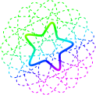

<p align="center">
    
</p>

---

# SSM Web GUI (Star Stone Miner Web GUI Version)

This project is an extended branch based on the core architecture of [kvarenzn/ssm](https://github.com/kvarenzn/ssm).
Given that the original author has stopped development (I think?), I've adapted its core architecture, using AI to quickly and easily introduce a GUI interface for greater ease of use. Since my HID is unusable, I've only tested the ADB functionality. There are still a few bugs to fix, but overall, the operation is smoother.

##  What's new

### 🎵 Smart Song Search

- Real-time search across the full Bestdori library
- One-click difficulty selection (EASY → SPECIAL)
- Still supports manual Song ID and custom `.txt` chart paths for the power users

### ▶️ Playback Control Panel

- **Now Playing card** — jacket art, song title, band, difficulty, all in one glance
- **Interrupt & restart instantly** — hit Stop, then Start again without re-loading anything
- **Offset adjustment** — fine-tune timing on the fly with keyboard shortcuts

## Quick Start
1. Download & Extract: Get the latest release from  [Releases](https://github.com/hj6hki123/ssm-gui/releases) and extract the .zip or .7z file to your computer.
2. Double-click `ssm-gui.exe`, or run it from a terminal:
   ```
   ssm-gui.exe
   ```
3. Your browser will open automatically at `http://127.0.0.1:8765`.  
   If it doesn't, open it manually.
4. Follow the three steps in the UI: **Song Setup → Play Control → Start**.

**_Currently supporting windows-amd64 only. Build it yourself for other OSs, or better yet, send a PR with some GitHub Actions because I'm too lazy to set them up lol._**

## Disclaimer
This program was heavily developed with the assistance of AI. Please use it at your own discretion and feel free to report any unexpected bugs or issues.
> [!CAUTION]
> **For certain SPECIAL difficulty songs, such as [Game Changer](https://bestdori.com/info/songs/782/Game-Changer), some movements have already been handled. However, patterns like left-right directions after sustained presses are still frequently missed. A preliminary solution has been implemented, and further help is welcome from anyone willing to contribute.**

## Future Projects
1. Mobile Porting & Deployment: Porting the application to mobile devices for use on non-rooted hardware (leveraging ADB tools such as Shizuku).

2. Automated Rhythm Game Playback: Implementation of image recognition for automated gameplay in rhythm games.

---

## 📜 License & Credits

* **Core Play Logic & Chart Parsing**: Credited to the original author [kvarenzn](https://github.com/kvarenzn/ssm).
* **Web GUI Implementation**: Custom integrated control panel developed specifically for this branch.
* This project is licensed under the **GPL-3.0-or-later** license.