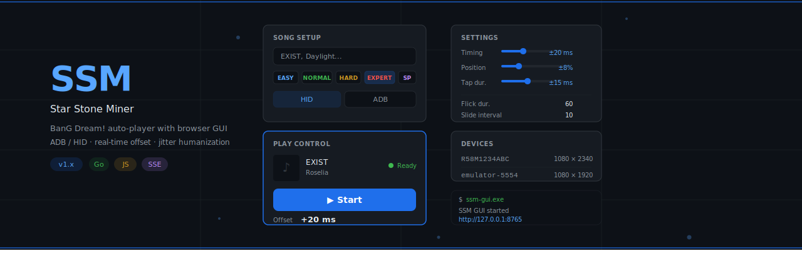

    
     
    <strong>A Web-based GUI for automated mobile rhythm game playback and chart parsing.</strong>

# SSM Web GUI (Star Stone Miner Web GUI Version)

This project is an extended branch based on the core architecture of [kvarenzn/ssm](https://github.com/kvarenzn/ssm).
~~Given that the original author has stopped development (I think?)~~ , once again express my gratitude to kvarenzn for the excellent work. I’ve basically just wrapped a simple GUI shell  around the original core architecture to make the gameplay experience even more convenient and user-friendly.

**If you're looking for an easier way to play, give this version a try!**

##  What's new

### 🎵 Smart Song Search

- Real-time search across the full Bestdori library
- One-click difficulty selection (EASY → SPECIAL)
- Still supports manual Song ID and custom `.txt` chart paths for the power users

### ▶️ Playback Control Panel

- **Now Playing card** — jacket art, song title, band, difficulty, all in one glance
- **Interrupt & restart instantly** — hit Stop, then Start again without re-loading anything
- **Offset adjustment** — fine-tune timing on the fly with keyboard shortcuts

## Requirements 
1. A computer, a mobile phone, and a data transfer cable
2. A pair of skillful hands

## Quick Start

1. **Download & Extract**: Get the latest release from [Releases](https://github.com/hj6hki123/ssm-gui/releases) and extract the archive.
* *Note*: If you have already downloaded the original project, simply place the .exe version into the same folder.
2. **Launch**: Double-click **ssm-gui.exe**, or run it from a terminal using the command **`./ssm-gui.exe`**.
3. **Access UI**: Your browser should open automatically at **http://127.0.0.1:8765**. If it doesn't, open it manually.
4. **Connect Device**: Connect your mobile device to your computer and ensure **ADB Debugging** is enabled.
5. **Device Setup**: 
   - Go to the **Settings** page to add your device.
   - **Select Connection Type**: Choose **HID** or **ADB** . ( **HID** mode may not work on Windows due to protocol overrides; you can try running `adb kill-server` to resolve conflicts)
   - **Identify Device**: Enter your device ID (found via **`adb devices`**) and your screen resolution .
   - *Alternative*: You can skip the Settings page. When you click **LOAD & PLAY**, the terminal will prompt you to enter the connection type and resolution manually.
6. **Start Playing**: Follow the workflow in the UI: **Song Setup → Play Control → Start**.

* *Note*: Legacy command-line methods are still supported—simply append your parameters. For details, please refer to [kvarenzn's Usage Guide](https://github.com/kvarenzn/ssm/blob/main/docs/USAGE.md).

## Disclaimer
This program was heavily developed with the assistance of AI. Please use it at your own discretion and feel free to report any unexpected bugs or issues.

> [!IMPORTANT]
> **This project is developed for personal learning and research purposes only. The stability and applicability of its functions are not guaranteed.**
>
> * **Non-Affiliation**: This project is an independent third-party tool and is **not** affiliated with, authorized by, or associated with any game developers, publishers, or related organizations.
> * **Risk of Use**: Use of this project may violate the service terms of the games or platforms involved, potentially leading to account suspension, bans, or data corruption.
> * **Limitation of Liability**: The author assumes no responsibility for any consequences resulting from the use of this project. Users are advised to evaluate the risks and use the software with caution.

## Future Projects
1. Mobile Porting & Deployment: Porting the application to mobile devices for use on non-rooted hardware (leveraging ADB tools such as Shizuku).

2. Automated Rhythm Game Playback: Implementation of image recognition for automated gameplay in rhythm games.

---

## 📜 License & Credits

* **Core Play Logic & Chart Parsing**: Credited to the original author [kvarenzn](https://github.com/kvarenzn/ssm).
* **Web GUI Implementation**: Custom integrated control panel developed specifically for this branch.
* This project is licensed under the **GPL-3.0-or-later** license.
